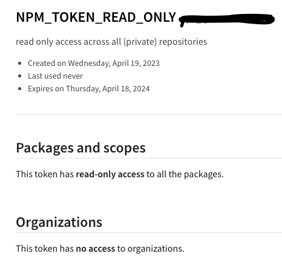
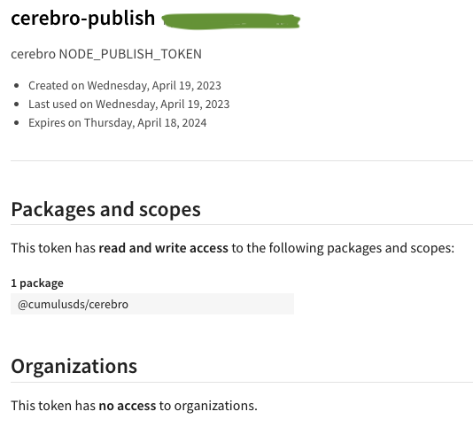

# NPM tokens

Cumulus CI uses two types of NPM tokens - read-only and publish tokens.  All tokens are created in npmjs with the 
maximum of 365 days until expiry, and should have a valid description, 
e.g. "read only access across all (private) repositories"

## Read-Only

The organization wide `NPM_TOKEN_READ_ONLY` secret, available to private repositories only is a granular access token 
with read-only access to all packages.  

It is not created with any Organizations permission.

## Publish

Publish tokens are created on a per-package basis and stored in a GitHub secret which is scoped to that repository only.

It is not created with any Organizations permission.

